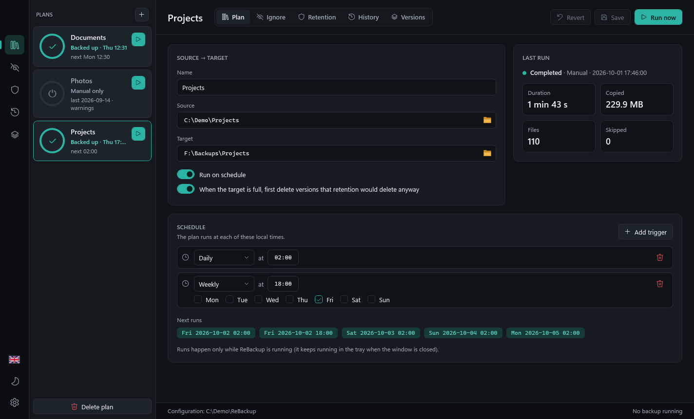
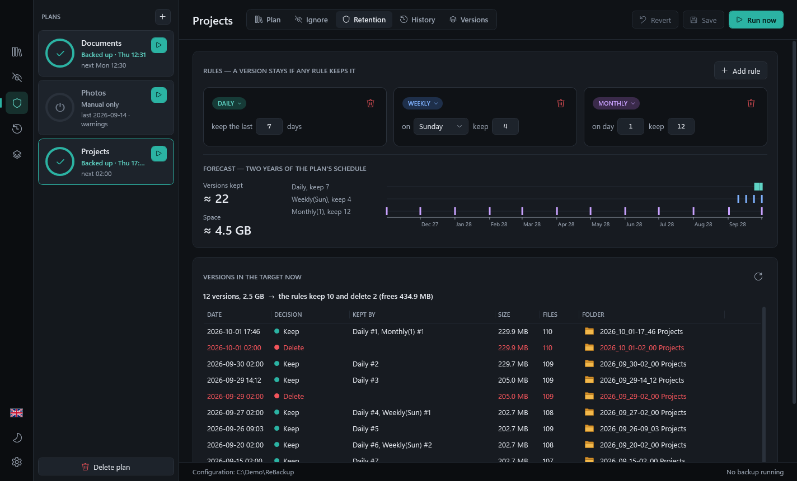
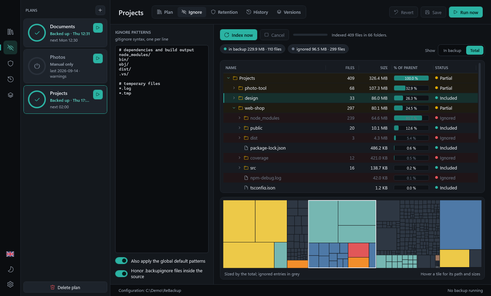
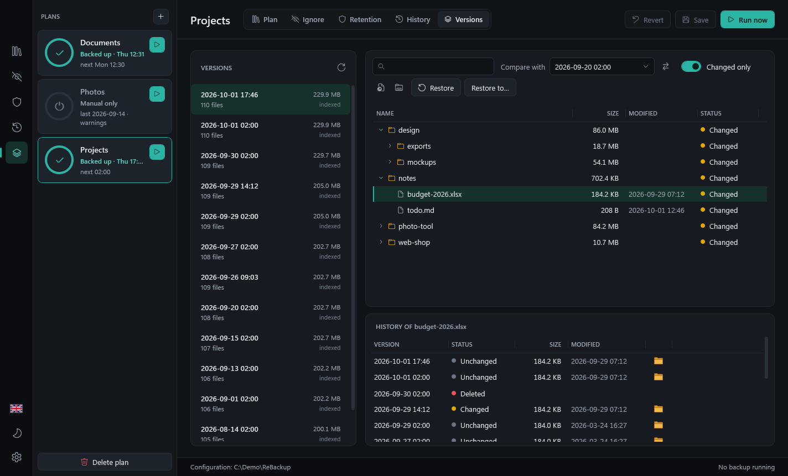
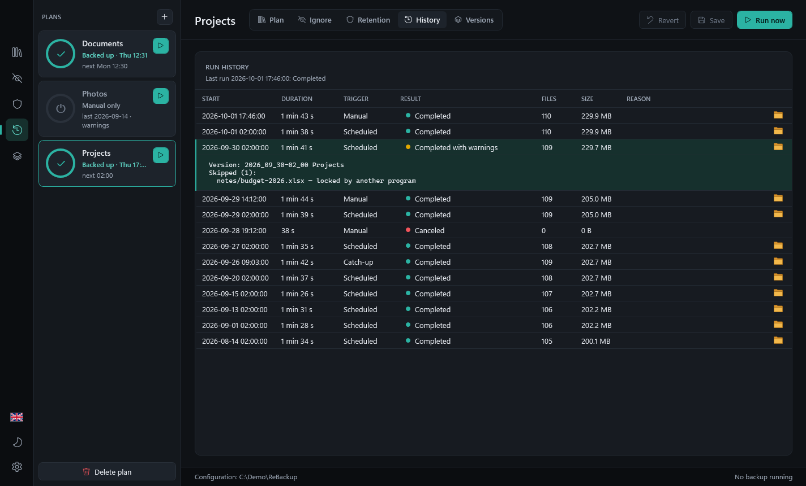
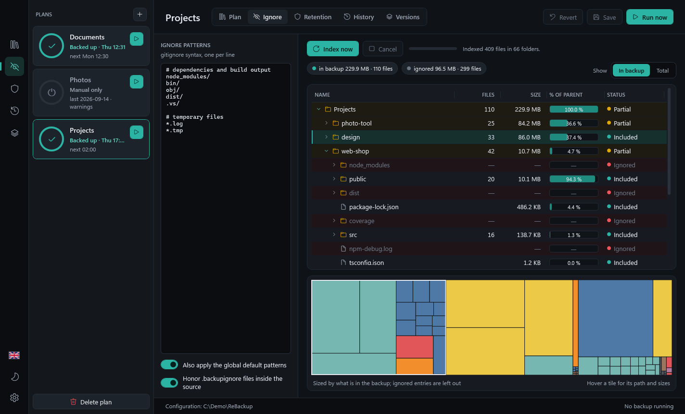
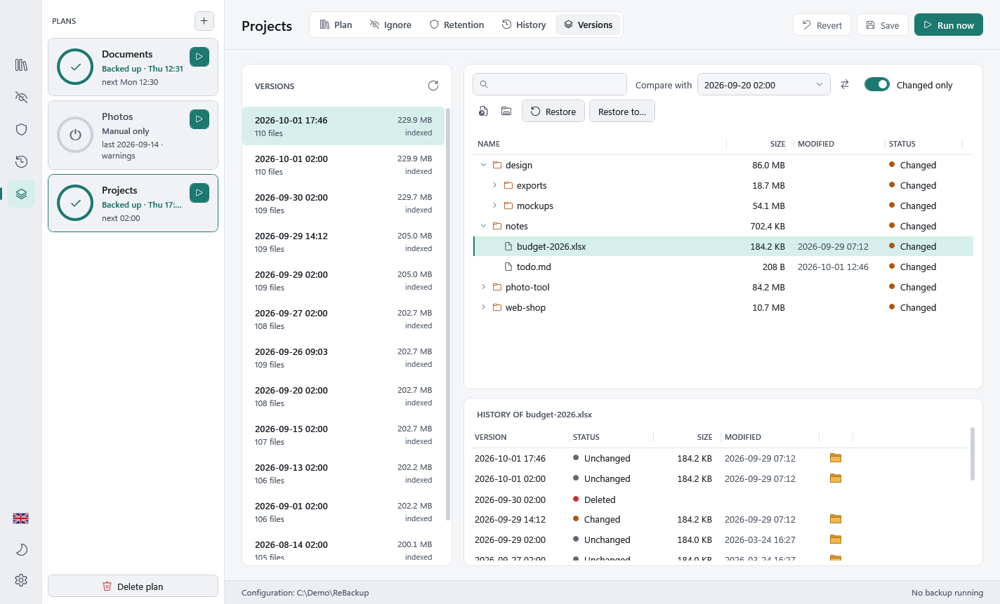
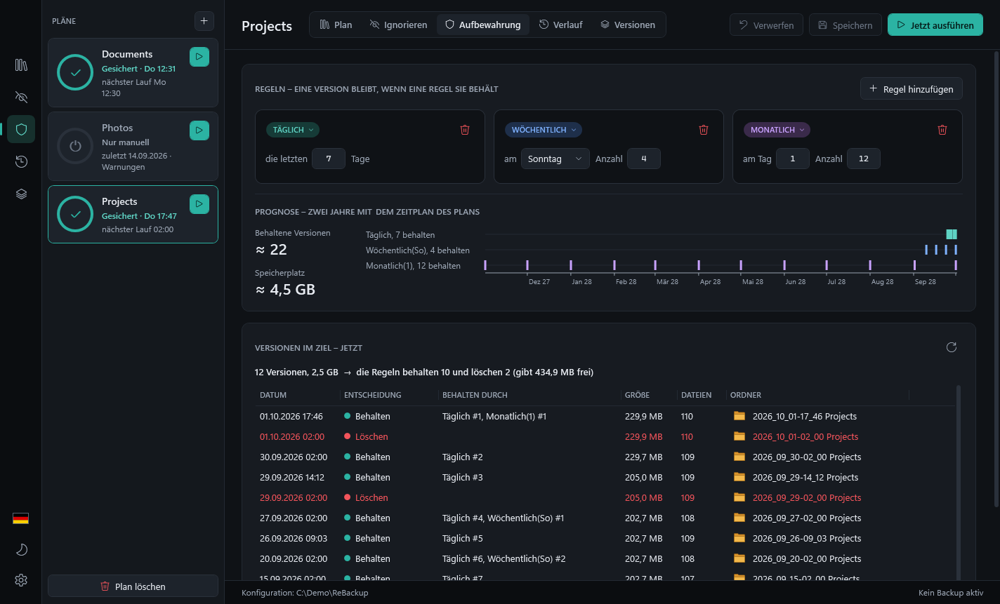

<p align="center">
  
</p>

<h1 align="center">ReBackup</h1>

<p align="center">
  A Windows backup manager for folders: plain full copies on a schedule, retention rules you can see the effect of,
  and a preview that shows what goes into the backup before it runs.
</p>

<p align="center">
  
  
  
  
</p>

<p align="center">
  Made by <a href="https://moon-labs.io">Moon Labs UG (haftungsbeschränkt)</a>
</p>



---

## Highlights

### Retention you can predict

- **Anchored rules**: keep the last *n* days, weeks (from a weekday), months (from a day of the month) or years
  (from a date). For example *daily 7 · weekly Sunday 4 · monthly 1st 12*.
- **A version stays if any rule keeps it.** The newest version always stays. Each version shows which rules keep it
  (`Daily #2, Monthly(1) #1`).
- **Live "now" preview**: while you edit the rules, the list of versions in the target shows *Keep* or *Delete* for
  each one, plus how much space the deletions would free.
- **Two-year forecast**: ReBackup simulates the plan's own schedule for two years and shows how many versions the
  target will hold, about how much space they need, and a timeline of which rule keeps which version.



### Ignore & Preview

- **gitignore syntax**: `node_modules/`, `*.tmp`, `!keep.tmp`, `**`, anchored `/build/` and so on, matched without
  regard to case. Global default patterns (`Thumbs.db`, `desktop.ini`, `$RECYCLE.BIN/`,
  `System Volume Information/`) and nested **`.backupignore`** files inside the source add to the plan's patterns.
- **Live, parallel scan**: the source is scanned four folders at a time. Folders show up at once and can be
  expanded while the scan is still running. Sizes and ignore status fill in as files are found.
- **Tree and treemap, like WinDirStat**: size, file count and *% of parent* bars, plus a squarified treemap coloured
  by file extension. Click a tile to find it in the tree; select a row to outline it in the treemap.
- **In backup / Total**: show only what will be backed up, or everything with the ignored parts in grey.
- **Why is this ignored?** The tooltip names the pattern and where it came from (plan, global defaults or a
  `.backupignore` file). From the context menu you can ignore an entry, ignore every file with its extension, or
  un-ignore it. Pattern changes are applied to the cached scan without scanning again.



---

## Features

| Area | What you get |
|---|---|
| **Plans** | One source folder and one target folder per plan, any number of plans. Turn off "Run on schedule" for manual-only plans. Optionally, when the target is full, delete the versions that retention would delete anyway before giving up. |
| **Schedules** | Triggers: **Daily** (time), **Weekly** (weekdays + time), **Monthly** (day 1–31, `0` = last day, `-1` = the day before it), **Interval** (every *n* hours between two times). Shows the next five runs. On startup, a plan that missed a trigger gets **one catch-up run** about a minute later. |
| **Versions** | Every run is a **full copy** in its own folder `YYYY_MM_DD-hh_mm <Plan>` with a `re-manifest.json` that lists every file with size, modification time and an **xxHash64** hash. No archive format: a version is an ordinary folder you can open in Explorer. |
| **Run history** | Start, duration, trigger (manual, scheduled, catch-up), result, files, size. Select a run to see skipped files and versions deleted by retention. Results: completed, completed with warnings, target full, error, canceled. |
| **Versions tab** | Browse any version, search names (substring or `*`/`?`), **compare two versions** (added / changed / deleted, optionally changed only), and see a **file's history** across all versions. **Delete versions** by hand (one or several, after a confirmation); the index is cleaned up with them. Backed by a local SQLite index per plan. |
| **Restore** | Restore a file, a folder or a whole version to its original location or to a folder of your choice. If files already exist you choose **Overwrite**, **Skip** or **Keep both** (or cancel). A restore **never deletes** anything at the destination. |
| **App** | **Dark and Light** theme, **English and German** (both switch at once, no restart), tray icon with Open, Run plan, Pause scheduler and Exit, a notification when a run ends, start with Windows, a single instance. |
| **Distribution** | One self-contained `.exe` for Windows x64; no installer, no .NET runtime to install. |

### A closer look

**Versions: compare, file history, restore.** Pick a version, compare it with another one, and select a file to
see what happened to it in every version. Here the spreadsheet was locked by another program during one run, so
that version does not have it.



**History.** Every run is logged, including canceled ones and the files that were skipped.



**Ignore & Preview, "In backup" view.** Only what will be backed up counts; ignored folders show `—`.



**Light theme and German.** Theme and language are switched from the left rail or in Settings and apply at once.

| Light theme | Deutsch |
|---|---|
|  |  |

---

## Getting started

### Run the exe

1. Get `ReBackup-<version>-win-x64.exe` from the [releases](https://github.com/MoonLabsDev/re-backup/releases) of
   this repository, or build it yourself (below).
2. Start it. There is no installer; the exe can live in any folder.
3. Create a plan with **+** next to *PLANS*: name, source folder, target folder.
4. Check the **Ignore** tab: press **Index now**, look at the tree and treemap, and adjust the patterns.
5. Set up the schedule on the **Plan** tab and the rules on the **Retention** tab, then **Save** (Ctrl+S).
6. Press **Run now**, or let the schedule run. Closing the window keeps ReBackup in the tray.

Requirements: Windows 10 or 11 (x64; an arm64 build can be published, see below).

### Build from source

Needs the [.NET 9 SDK](https://dotnet.microsoft.com/download/dotnet/9.0).

```powershell
dotnet build                                  # whole solution: app, core library and tests
dotnet test                                   # the core test suite
dotnet run --project src/ReBackup.App         # start the app
```

### Publish a single exe

`publish.ps1` publishes the app in Release as one file and copies it to `dist\`.

```powershell
.\publish.ps1                       # dist\ReBackup-1.1.0-win-x64.exe, self-contained (.NET runtime included)
.\publish.ps1 -Version 1.1.1        # override the version from Directory.Build.props
.\publish.ps1 -FrameworkDependent   # dist\ReBackup-1.1.0-win-x64-fd.exe, small, needs the .NET 9 Desktop Runtime
.\publish.ps1 -Runtime win-arm64    # for Windows on ARM
```

---

## How it works

```
plan ─► scan source ─► apply ignore patterns ─► reserve "YYYY_MM_DD-hh_mm <Plan>" with re-pending.json
     ─► copy (hashing while copying) ─► write re-manifest.json ─► remove re-pending.json ─► apply retention
```

1. **Preflight.** The source must exist. ReBackup scans it, applies the ignore patterns and checks that the target
   has room for the included size plus 5 %. If not, and the plan allows it, it first deletes versions that
   retention would delete anyway; otherwise the run ends as *target full* before anything is written.
2. **Copy.** The version folder is reserved by creating `re-pending.json` in it; while that marker is there, the
   folder is not a version. Files are copied into it with their relative paths and modification times; each file is
   hashed with xxHash64 while it is read. Files that are locked or cannot be read are **skipped and logged**; the run
   continues and ends as *completed with warnings*.
3. **Finish.** `re-manifest.json` is written, `re-pending.json` is removed, and retention runs.
   Retention deletes only folders that are versions of this plan (the name and the plan id in the manifest must
   match). Other folders in the target are shown as *not managed* and are never deleted.
4. **Cancel or error.** What the run wrote is removed, the marker last; whatever cannot be removed keeps the marker
   and is removed at the plan's next run. The run is logged either way.

A target can look like this:

```
F:\Backups\Projects\
  2026_09_30-02_00 Projects\      a version: full copy + re-manifest.json
  2026_10_01-02_00 Projects\
  2026_10_01-17_46 Projects\
```

### Where ReBackup keeps its data

| What | Where |
|---|---|
| Settings | `%AppData%\ReBackup\settings.json` |
| Plans | `%AppData%\ReBackup\plans\<plan-id>.json` |
| Run history | `%AppData%\ReBackup\logs\<plan-id>.jsonl` (one JSON line per run) |
| Version index | `%LocalAppData%\ReBackup\index\<plan-id>.db` (SQLite cache, rebuilt from the manifests if deleted) |
| Backups | the plan's target folder |

The configuration folder can be moved in **Settings** (for example to a synced folder); ReBackup then restarts and
uses it. Plan files are plain JSON and are reloaded when they change on disk.

---

## Amazon S3

The code base contains an Amazon S3 storage provider and a dialog to set up and test an S3 connection. The ReBackup
app does not offer S3 as a source or target yet; that comes with a later version. What follows is what such a
connection will need.

A connection is a region, a bucket and an access key (access key ID and secret access key). The connection test
checks that the bucket can be reached and listed, optionally that a test object can be written and deleted, and
whether the bucket has the recommended lifecycle rule. If the bucket is in a different region, it offers that region.

**Minimum IAM permissions.** The access key needs these actions on the bucket (`s3:GetLifecycleConfiguration` is
optional; without it the test reports the lifecycle rule as *cannot be checked*). `s3:AbortMultipartUpload` lets an
interrupted upload of a large file clean up its parts; AWS checks it separately from `s3:PutObject`.
Grant `s3:ListBucket` on the whole bucket, without an `s3:prefix` condition, even when the access key should only use
one folder (prefix) of a shared bucket; limit the object actions to that prefix instead (for example
`arn:aws:s3:::my-backup-bucket/wp/elvora/*`). Without an effective `s3:ListBucket`, S3 answers a request for a missing
file with "access denied" instead of "not found":

```json
{
  "Version": "2012-10-17",
  "Statement": [
    { "Effect": "Allow", "Action": ["s3:ListBucket", "s3:GetLifecycleConfiguration"],
      "Resource": "arn:aws:s3:::my-backup-bucket" },
    { "Effect": "Allow", "Action": ["s3:GetObject", "s3:PutObject", "s3:DeleteObject",
                                    "s3:AbortMultipartUpload"],
      "Resource": "arn:aws:s3:::my-backup-bucket/*" }
  ]
}
```

**Recommended lifecycle rule: abort incomplete multipart uploads after 7 days.** Large files are uploaded in parts.
If an upload is interrupted and cannot be cleaned up (a crash, a lost connection), its parts stay in the bucket: not
visible in normal listings, but billed. The rule removes them. The connection test warns when the bucket has no such
rule.

**Secrets stay on your Windows account.** The secret access key is stored encrypted with Windows DPAPI and is bound
to your Windows account: another account, or a copy of the connection file on another PC, cannot decrypt it, and the
secret has to be entered again. It is never written in plain text or logged.

---

## FAQ and limits

**Does it run without the app?**
No. There is no Windows service. Schedules run while ReBackup runs; closing the window keeps it in the tray, and
"Start with Windows" starts it minimized at sign-in. Missed triggers get one catch-up run at the next start.

**Are open files backed up?**
Only if they can be read. ReBackup does not use Volume Shadow Copy (VSS): a file that is locked by another program
is skipped and listed in the run history.

**Is the backup compressed or encrypted?**
No. Each version is a full, uncompressed, unencrypted copy. That uses more space than incremental tools, but every
version is an ordinary folder you can open without ReBackup. Use an encrypted drive (for example BitLocker) if the
target needs protection.

**Can a restore overwrite or delete my files?**
A restore never deletes anything. Existing files are overwritten only if you choose *Overwrite*; *Keep both* writes
the version's copy next to the existing file with the version's time in its name.

**Which systems?**
Windows 10 and 11 only (WPF). The target can be any folder Windows can reach by path: another disk, a USB drive or
a network share.

**Can a plan have several source folders?**
No, one source per plan. Create one plan per folder.

**Can I go back to 1.0.x after updating to 1.1?**
No. 1.1 reads everything 1.0.x wrote (plans, versions, leftovers), but it saves plans in a new format that 1.0.x
cannot load, and it marks versions while they are written or deleted with files 1.0.x does not know. Update in one
direction only.

---

## Disclaimer

ReBackup was developed with the help of AI. It is provided as is, without warranty of any kind, and without
liability for lost or damaged data. Check your backups regularly and try a restore now and then: a backup is only
as good as the restore you have tested.

## License

ReBackup is released under the [MIT License](LICENSE).
Copyright © 2026 [Moon Labs UG (haftungsbeschränkt)](https://moon-labs.io).
